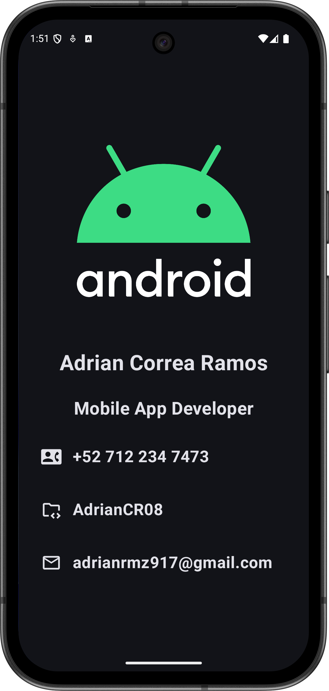

# BusinessCard
A simple Business Card app built with Jetpack Compose. It displays my contact information as a mobile app developer, including phone number, GitHub profile, and email. Designed to serve as a digital personal card for networking and portfolio purposes.

- 📞 Call me directly
- 💼 Visit my GitHub profile
- ✉️ Send me an email

## 🚀 Features

- Clean and responsive UI built with Jetpack Compose
- Light and dark theme support
- Interactive contact elements:
    - Tap on the phone number to open the dialer
    - Tap on the GitHub username to open the browser
    - Tap on the email to open a mail app
---

## 📸 Preview:  
  

## 🛠️ Built With

- Kotlin
- Jetpack Compose
- Android Studio

## 📬 Contact

Feel free to reach out to me:

- 📞 +52 712 234 7473
- 💼 [GitHub](https://github.com/AdrianCR08)
- ✉️ adrianrmz917@gmail.com

---

### 🤝 License

This project is for educational and personal portfolio purposes.